# DESPLIEGUE — Evidencias y respuestas

Este documento recopila todas las evidencias y respuestas de la practica.

---

## Parte 1 — Evidencias minimas

### Fase 1: Instalacion y configuracion

1) Servicio Nginx activo
- Que demuestra: El servidor Nginx esta corriendo correctamente dentro del contenedor Docker
- Comando: `docker compose ps`
- Evidencia: 

2) Configuracion cargada
- Que demuestra: El archivo de configuracion personalizado (default.conf) esta correctamente montado en el contenedor
- Comando: `docker exec nginx-web ls -la /etc/nginx/conf.d/`
- Evidencia: 

3) Resolucion de nombres
- Que demuestra: El archivo hosts de Windows esta configurado para resolver nombres personalizados (127.0.0.1 miweb.local)
- Evidencia: 

4) Contenido Web
- Que demuestra: La pagina web personalizada de Cloud Academy se muestra correctamente (no es la pagina por defecto de Nginx)
- Evidencia: 

### Fase 2: Transferencia SFTP (Filezilla)

5) Conexion SFTP exitosa
- Que demuestra: FileZilla se conecta correctamente al servidor SFTP usando localhost:2222 con credenciales usuario/password
- Evidencia: 

6) Permisos de escritura
- Que demuestra: Los archivos se pueden subir por SFTP sin errores de permisos
- Evidencia: 

### Fase 3: Infraestructura Docker

7) Contenedores activos
- Que demuestra: Ambos contenedores (nginx-web y sftp-server) estan corriendo simultaneamente con sus puertos mapeados
- Comando: `docker compose ps`
- Evidencia: 

8) Persistencia (Volumen compartido)
- Que demuestra: Los archivos subidos por SFTP aparecen automaticamente en la web gracias al volumen compartido shared-data
- Evidencia: 

9) Despliegue multi-sitio
- Que demuestra: El servidor web sirve multiples sitios - la web principal en / y el reloj en /reloj
- Evidencia: 

### Fase 4: Seguridad HTTPS

10) Cifrado SSL
- Que demuestra: El servidor responde por HTTPS con certificados SSL autofirmados correctamente configurados
- Evidencia: 

11) Redireccion forzada
- Que demuestra: Las peticiones HTTP (puerto 8080) se redirigen automaticamente a HTTPS (puerto 8443) con codigo 301
- Evidencia: 

---

## Parte 2 — Evaluacion RA2 (a–j)

### a) Parametros de administracion

Para ver los parametros de administracion mas importantes de Nginx, he buscado dentro del contenedor en el archivo `/etc/nginx/nginx.conf`:

```bash
docker compose exec web sh -c "grep -nE 'worker_processes|worker_connections|access_log|error_log|gzip|include|keepalive_timeout' /etc/nginx/nginx.conf"
```

El resultado muestra donde estan las directivas:

```
3:worker_processes  auto;
5:error_log  /var/log/nginx/error.log notice;
10:    worker_connections  1024;
15:    include       /etc/nginx/mime.types;
22:    access_log  /var/log/nginx/access.log  main;
27:    keepalive_timeout  65;
29:    #gzip  on;
31:    include /etc/nginx/conf.d/*.conf;
```

Evidencia: 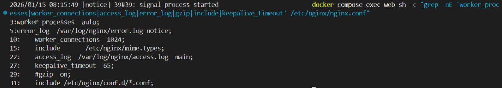

Segun lo que he aprendido, cada directiva hace lo siguiente:

- **worker_processes**: Cuantos procesos crea Nginx para atender peticiones
- **error_log**: Donde guarda los errores
- **worker_connections**: Cuantas conexiones puede manejar cada worker
- **include**: Carga otros archivos de configuracion
- **access_log**: Donde guarda el registro de visitas
- **keepalive_timeout**: Cuanto tiempo mantiene una conexion abierta sin actividad
- **gzip**: Para comprimir las respuestas (esta comentado)

#### Cambio aplicado

He modificado el `keepalive_timeout` de 65 a 30 segundos. Este cambio lo he hecho en mi archivo `default.conf` que se monta en el contenedor, asi no toco el nginx.conf original:

```nginx
keepalive_timeout 30;
```

Despues he validado que la configuracion es correcta:

```bash
docker compose exec web nginx -t
```

Evidencia: 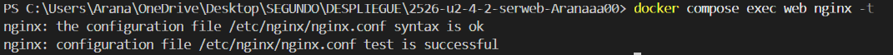

Y finalmente he recargado Nginx para aplicar los cambios:

```bash
docker compose exec web nginx -s reload
```

Evidencia: 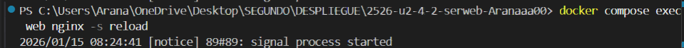

### b) Ampliacion de funcionalidad + modulo investigado

He elegido la opcion B2: cabeceras de seguridad.

#### Cabeceras de seguridad

He añadido tres cabeceras de seguridad en el bloque server HTTPS de mi `default.conf`:

```nginx
# Cabeceras de seguridad
add_header X-Content-Type-Options nosniff;
add_header X-Frame-Options DENY;
add_header Content-Security-Policy "default-src 'self'";
```

Que significa cada una:

- **X-Content-Type-Options: nosniff** → Evita que el navegador intente adivinar el tipo de archivo. Si digo que es HTML, es HTML y punto.

- **X-Frame-Options: DENY** → Prohibe que mi web se cargue dentro de un iframe de otra pagina. Esto evita ataques de clickjacking.

- **Content-Security-Policy: default-src 'self'** → Solo permite cargar recursos (scripts, imagenes, etc) desde mi propio dominio.

Evidencia: 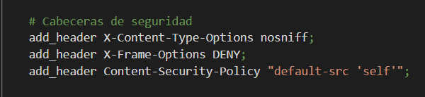

Despues valide la configuracion:

```bash
docker compose exec web nginx -t
```

Evidencia: 

Y comprobe con curl que las cabeceras aparecen en la respuesta HTTPS:

```bash
curl.exe -I -k https://localhost:8443/
```

El resultado muestra las tres cabeceras:
```
X-Content-Type-Options: nosniff
X-Frame-Options: DENY
Content-Security-Policy: default-src 'self'
```

Evidencia: 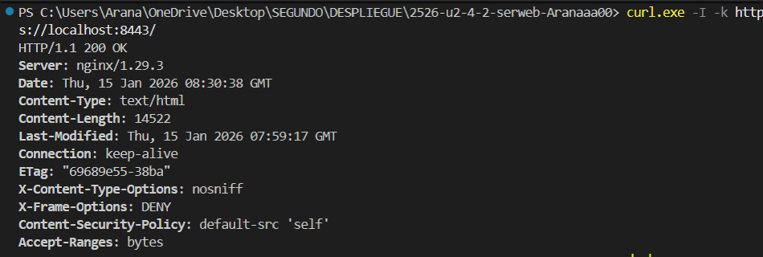

#### Modulo investigado: ngx_http_headers_more_module (su documentación esta en ingles pero me parecio bastante interesante)

Este modulo permite modificar las cabeceras HTTP de forma mas avanzada que el `add_header` normal de Nginx.

**Para que sirve:**
- Permite añadir, modificar o eliminar cualquier cabecera de peticion o respuesta
- Puede modificar cabeceras que el add_header normal no puede tocar (como Server o Date)
- Util para ocultar la version de Nginx por seguridad

**Como se instala:**
En Nginx normal hay que compilarlo desde el codigo fuente o instalarlo como modulo dinamico. En algunas distribuciones viene en el paquete `nginx-extras`:

```bash
# En Debian/Ubuntu
apt install nginx-extras

# O compilando desde fuente
./configure --add-module=/path/to/headers-more-nginx-module
```

Despues se carga con:
```nginx
load_module modules/ngx_http_headers_more_filter_module.so;
```

**Fuente consultada:**
- Repositorio oficial del modulo: https://github.com/openresty/headers-more-nginx-module

### c) Sitios virtuales / multi-sitio

En este proyecto tengo configurado un multi-sitio por path, es decir, varias webs dentro del mismo servidor pero en rutas diferentes:

- La web principal esta en `/` → https://localhost:8443/
- La web del reloj esta en `/reloj` → https://localhost:8443/reloj

Evidencia web principal: 

Evidencia web reloj: 

#### Diferencia entre multi-sitio por path y por nombre

El multi-sitio **por path** usa la misma direccion pero cambia la ruta. Por ejemplo `miweb.com/` y `miweb.com/blog`. Todo esta bajo el mismo dominio y el mismo bloque server, solo cambian los bloques location.

El multi-sitio **por nombre** (server_name) usa dominios diferentes. Por ejemplo `miweb.com` y `blog.miweb.com`. Cada dominio tiene su propio bloque server con su server_name distinto.

#### Otros tipos de multi-sitio

- **Por puerto**: El mismo servidor escucha en puertos diferentes. Por ejemplo una web en el puerto 80 y otra en el 8080.

- **Por IP**: Si el servidor tiene varias direcciones IP, cada web puede responder en una IP diferente usando la directiva `listen` con la IP concreta.

#### Mi configuracion activa

He visto el contenido del archivo dentro del contenedor con:

```bash
docker compose exec web sh -c "sed -n '1,50p' /etc/nginx/conf.d/default.conf"
```

Las directivas clave para el multi-sitio son:

- **root /usr/share/nginx/html** → Define la carpeta base donde estan los archivos
- **location /** → Bloque que maneja las peticiones a la raiz
- **location /reloj** → Bloque que maneja las peticiones a /reloj
- **try_files $uri $uri/ =404** → Busca el archivo pedido, si no existe busca como carpeta, si tampoco existe devuelve 404

Cuando alguien entra a `/reloj`, Nginx busca en `/usr/share/nginx/html/reloj/` porque combina el root con la ruta.

Evidencia: 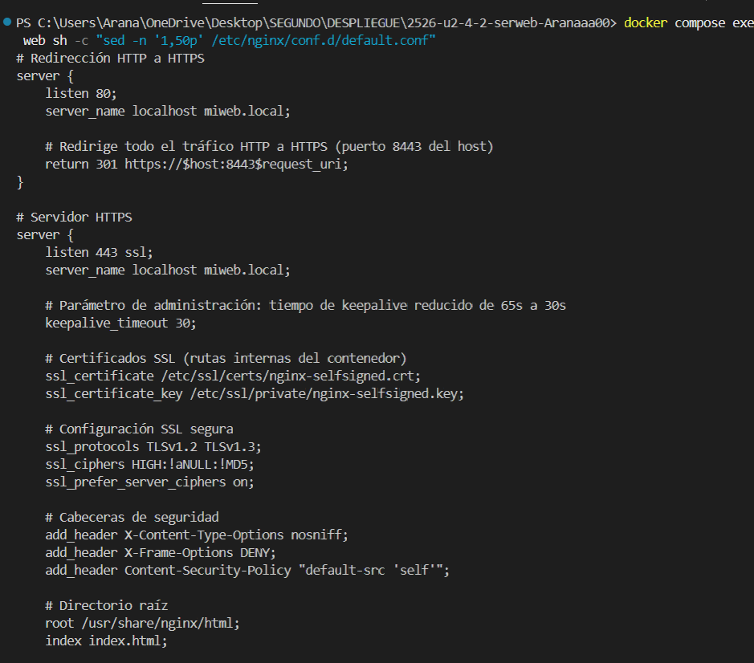

### d) Autenticacion y control de acceso

He creado una zona protegida en `/admin` que requiere usuario y contraseña para acceder.

#### Creacion del contenido protegido

Primero cree la carpeta admin con un index.html dentro del volumen compartido:

```bash
docker exec sftp-server sh -c "mkdir -p /home/usuario/upload/admin"
docker exec sftp-server sh -c "echo '<html><body><h1>Panel de Administracion</h1></body></html>' > /home/usuario/upload/admin/index.html"
```

Evidencia: 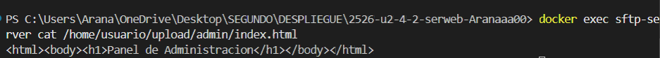

#### Configuracion de la autenticacion

Cree un archivo `.htpasswd` con el usuario y contraseña usando htpasswd:

```bash
docker run --rm httpd:alpine htpasswd -nb admin Admin1234!
```

Esto genera el hash de la contraseña que guarde en el archivo `.htpasswd`.

Luego añadi en `default.conf` un location para /admin con autenticacion basica:

```nginx
# Zona protegida con autenticacion
location /admin {
    auth_basic "Zona de Administracion";
    auth_basic_user_file /etc/nginx/.htpasswd;
    try_files $uri $uri/ =404;
}
```

- **auth_basic** → Activa la autenticacion y define el mensaje que sale en el popup
- **auth_basic_user_file** → Ruta al archivo con los usuarios y contraseñas

Evidencia: 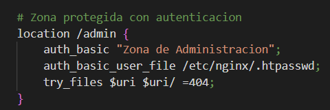

#### Prueba sin credenciales

```bash
curl.exe -I -k https://localhost:8443/admin/
```

Devuelve 401 Unauthorized:

```
HTTP/1.1 401 Unauthorized
WWW-Authenticate: Basic realm="Zona de Administracion"
```

Evidencia: 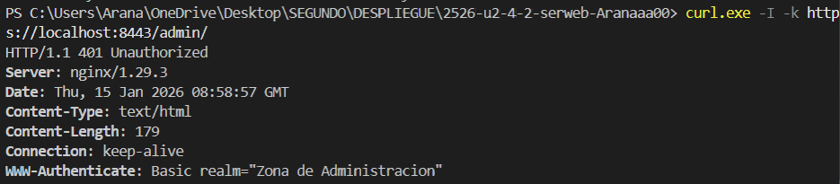

#### Prueba con credenciales

```bash
curl.exe -I -k -u admin:Admin1234! https://localhost:8443/admin/
```

Devuelve 200 OK:

```
HTTP/1.1 200 OK
```

Evidencia: 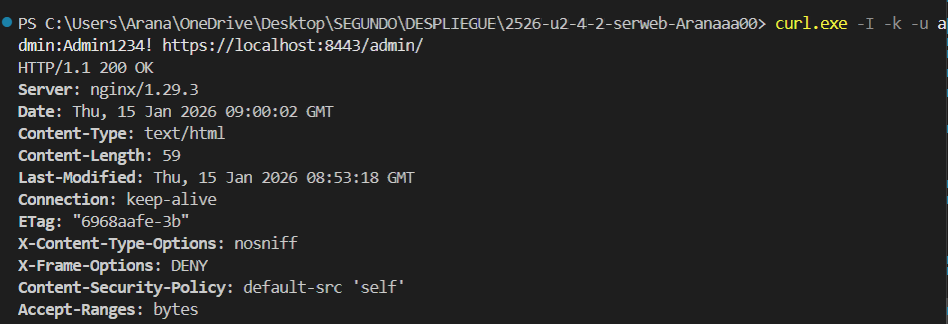

### e) Certificados digitales

Para configurar HTTPS necesitamos certificados digitales. En este proyecto he creado certificados autofirmados.

#### Que es .crt y .key

- **Archivo .crt (Certificate)**: Es el certificado digital publico. Contiene la clave publica, informacion del propietario (dominio, organizacion, etc) y la firma digital. Este archivo se comparte con los clientes que se conectan al servidor. Cuando un navegador accede por HTTPS, el servidor le envia este certificado para demostrar su identidad.

- **Archivo .key (Private Key)**: Es la clave privada. Este archivo nunca se comparte, solo lo tiene el servidor. Se usa para descifrar la informacion que los clientes cifran con la clave publica del certificado. Si alguien obtiene este archivo, podria suplantar al servidor.

La relacion entre ambos es como un candado y su llave: el .crt es el candado (publico, todos pueden verlo) y el .key es la llave (privada, solo el dueño la tiene).

#### Por que se usa -nodes en laboratorio

El parametro `-nodes` significa "no DES" (no cifrar la clave privada). Cuando generamos el certificado con:

```bash
openssl req -x509 -nodes -days 365 -newkey rsa:2048 -keyout nginx-selfsigned.key -out nginx-selfsigned.crt
```

El `-nodes` hace que la clave privada (.key) se guarde sin contraseña. 

**En laboratorio es util porque:**
- Nginx puede leer la clave automaticamente al arrancar sin pedir contraseña
- No hay que configurar ningun mecanismo para introducir la contraseña cada vez que reiniciamos el servidor
- Simplifica las pruebas y el desarrollo

**En produccion NO se recomienda** porque si alguien roba el archivo .key, puede usarlo directamente. En produccion se cifra la clave con contraseña y se configura un mecanismo seguro para que Nginx la obtenga al arrancar.

#### Ficheros generados

Para generar los certificados he usado OpenSSL:

```bash
openssl req -x509 -nodes -days 365 -newkey rsa:2048 -keyout nginx-selfsigned.key -out nginx-selfsigned.crt
```

**Comando usado:**
```bash
ls -l nginx-selfsigned.crt nginx-selfsigned.key
```

Evidencia: 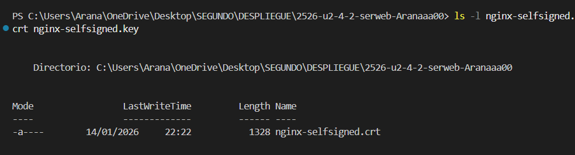

#### Montaje en docker-compose.yml

Los certificados se montan como volumenes en el contenedor de Nginx para que pueda usarlos:

```yaml
volumes:
  - ./nginx-selfsigned.crt:/etc/nginx/ssl/nginx-selfsigned.crt:ro
  - ./nginx-selfsigned.key:/etc/nginx/ssl/nginx-selfsigned.key:ro
```

Evidencia: 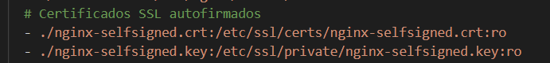

#### Uso en default.conf


En el archivo de configuracion de Nginx se especifican las rutas a los certificados:

```nginx
ssl_certificate /etc/nginx/ssl/nginx-selfsigned.crt;
ssl_certificate_key /etc/nginx/ssl/nginx-selfsigned.key;
```

Estas directivas van dentro del bloque server que escucha en el puerto 443 (HTTPS).

Evidencia: 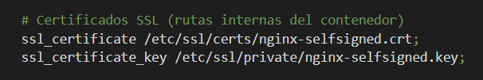

### f) Comunicaciones seguras

En este apartado demuestro que las comunicaciones entre cliente y servidor estan aseguradas mediante HTTPS y que HTTP redirige automaticamente.

#### HTTPS operativo

El servidor responde correctamente por HTTPS en el puerto 8443. Al acceder, el navegador muestra el candado (aunque con advertencia por ser certificado autofirmado).

Evidencia: 

#### Redireccion HTTP a HTTPS con 301

Cuando alguien entra por HTTP (puerto 8080), el servidor le redirige automaticamente a HTTPS (puerto 8443) con un codigo 301 (Moved Permanently).

Evidencia: 

#### Por que se usan dos bloques server

En la configuracion de Nginx tengo dos bloques server separados:

**Bloque server puerto 80 (HTTP):**
```nginx
server {
    listen 80;
    server_name localhost;
    return 301 https://$host:8443$request_uri;
}
```
Este bloque solo hace una cosa: redirigir todo el trafico a HTTPS. No sirve contenido, solo devuelve un 301.

**Bloque server puerto 443 (HTTPS):**
```nginx
server {
    listen 443 ssl;
    server_name localhost;
    ssl_certificate /etc/nginx/ssl/nginx-selfsigned.crt;
    ssl_certificate_key /etc/nginx/ssl/nginx-selfsigned.key;
    # ... resto de configuracion ...
}
```
Este bloque es el que realmente sirve el contenido de forma segura.

**Por que dos bloques y no uno:**
- Separacion de responsabilidades: cada bloque hace una cosa
- El puerto 80 no puede servir HTTPS (no tiene SSL configurado)
- El puerto 443 necesita los certificados SSL
- Si mezclaramos todo en uno, no podriamos redirigir correctamente

### g) Documentacion

Este apartado resume toda la configuracion, arquitectura y buenas practicas del proyecto.

#### Arquitectura del sistema

| Servicio | Contenedor | Puerto externo | Puerto interno | Funcion |
|----------|------------|----------------|----------------|---------|
| Nginx | nginx-web | 8080, 8443 | 80, 443 | Servidor web |
| SFTP | sftp-server | 2222 | 22 | Transferencia de archivos |

**Volumenes:**
- `shared-data` → Volumen compartido entre Nginx y SFTP para que los archivos subidos aparezcan en la web
- `./default.conf` → Configuracion personalizada de Nginx
- `./nginx-selfsigned.crt` y `./nginx-selfsigned.key` → Certificados SSL
- `./.htpasswd` → Archivo de credenciales para autenticacion

#### Configuracion Nginx

- **Ubicacion del archivo**: `./default.conf` montado en `/etc/nginx/conf.d/default.conf`
- **Server blocks**: Dos bloques, uno para HTTP (redireccion) y otro para HTTPS (contenido)
- **Root**: `/usr/share/nginx/html` donde estan los archivos web
- **Multi-sitio**: Web principal en `/` y reloj en `/reloj`

#### Seguridad implementada

- **Certificados**: Autofirmados con OpenSSL (`nginx-selfsigned.crt` y `nginx-selfsigned.key`)
- **HTTPS**: Puerto 443 con SSL habilitado
- **Redireccion**: HTTP redirige a HTTPS con codigo 301
- **Cabeceras de seguridad**:
  - `X-Content-Type-Options: nosniff`
  - `X-Frame-Options: DENY`
  - `Content-Security-Policy: default-src 'self'`

#### Autenticacion /admin

- **Metodo**: Autenticacion basica HTTP
- **Archivo de credenciales**: `.htpasswd` con usuario `admin`
- **Directivas**: `auth_basic` y `auth_basic_user_file`

#### Logs y analisis

- **Access log**: `/var/log/nginx/access.log` (registro de peticiones)
- **Error log**: `/var/log/nginx/error.log` (errores del servidor)
- **Comando para ver logs en tiempo real**: `docker compose logs -f web`

#### Evidencias del proyecto

Todas las evidencias estan organizadas en la carpeta `evidencias/`:

**Parte 1 - Evidencias minimas:**
- [01-nginx-activo.png](./evidencias/01-nginx-activo.png) - Servicio Nginx corriendo
- [02-configuracion-cargada.png](./evidencias/02-configuracion-cargada.png) - Configuracion montada
- [03-resolucion-nombres.png](./evidencias/03-resolucion-nombres.png) - Archivo hosts y contenido web
- [05-conexion-sftp.png](./evidencias/05-conexion-sftp.png) - FileZilla conectado
- [06-permiso-escritura.png](./evidencias/06-permiso-escritura.png) - Subida de archivos
- [07-persistencia-volumen.png](./evidencias/07-persistencia-volumen.png) - Volumen compartido
- [08-multisitio-reloj.png](./evidencias/08-multisitio-reloj.png) - Web del reloj
- [09-cifrado-ssl.png](./evidencias/09-cifrado-ssl.png) - HTTPS funcionando
- [10-redireccion-https.png](./evidencias/10-redireccion-https.png) - Redireccion 301

**Parte 2 - Evaluacion RA2:**

a) Parametros de administracion:
- [11-grep-nginxconf.png](./evidencias/11-grep-nginxconf.png) - Directivas nginx.conf
- [12-nginx-t.png](./evidencias/12-nginx-t.png) - Validacion configuracion
- [13-reload.png](./evidencias/13-reload.png) - Recarga de Nginx

b) Cabeceras de seguridad:
- [14-defaultconf-headers.png](./evidencias/14-defaultconf-headers.png) - Cabeceras en default.conf
- [15-curl-https-headers.png](./evidencias/15-curl-https-headers.png) - Cabeceras en respuesta

c) Multi-sitio:
- [16-root.png](./evidencias/16-root.png) - Web principal
- [17-reloj.png](./evidencias/17-reloj.png) - Web del reloj
- [18-defaultconf-inside.png](./evidencias/18-defaultconf-inside.png) - Configuracion multi-sitio

d) Autenticacion:
- [19-admin-html.png](./evidencias/19-admin-html.png) - Contenido admin
- [20-defaultconf-auth.png](./evidencias/20-defaultconf-auth.png) - Configuracion auth
- [21-curl-401.png](./evidencias/21-curl-401.png) - Acceso sin credenciales
- [22-curl-200.png](./evidencias/22-curl-200.png) - Acceso con credenciales

e) Certificados:
- [23-ls-certificado.png](./evidencias/23-ls-certificado.png) - Ficheros generados
- [24-compose-certificado.png](./evidencias/24-compose-certificado.png) - Montaje en compose
- [25-defaultconf-ssl.png](./evidencias/25-defaultconf-ssl.png) - SSL en default.conf

f) Comunicaciones seguras:
- [26-https.png](./evidencias/26-https.png) - HTTPS operativo
- [27-301-network.png](./evidencias/27-301-network.png) - Redireccion 301

### h) Ajustes para implantacion de apps

Este apartado explica los ajustes necesarios para desplegar aplicaciones en Nginx, usando como ejemplo la web del reloj en `/reloj`.

#### Desplegar una segunda app en /reloj

Para añadir una segunda aplicacion en una subruta como `/reloj`, hay que tener en cuenta:

**Estructura de carpetas:**
La aplicacion debe estar en una subcarpeta dentro del root. En mi caso:
```
/usr/share/nginx/html/
├── index.html          ← Web principal (/)
├── static-website-example/
└── reloj/
    ├── index.html      ← Web del reloj (/reloj)
    ├── script.js
    └── style.css
```

**Configuracion en Nginx:**
Se añade un bloque location para la subruta:
```nginx
location /reloj {
    try_files $uri $uri/ =404;
}
```

**Problema de rutas relativas vs absolutas:**

Este es el problema mas comun al desplegar una app en una subruta:

- **Rutas absolutas** (empiezan con `/`): Siempre buscan desde la raiz del servidor. Por ejemplo, `/style.css` busca en `https://localhost:8443/style.css`, NO en `/reloj/style.css`. Esto rompe la app si esta en una subruta.

- **Rutas relativas** (sin `/` al inicio): Buscan desde la ubicacion actual. Por ejemplo, `style.css` o `./style.css` busca en la misma carpeta donde esta el HTML.

**Solucion aplicada:**
En la web del reloj, los archivos usan rutas relativas:
```html
<link rel="stylesheet" href="style.css">
<script src="script.js"></script>
```

Asi funciona tanto si la app esta en `/` como en `/reloj` o cualquier otra subruta.

#### Problema tipico de permisos SFTP

**El problema:**
Al subir archivos por SFTP, a veces Nginx no puede leerlos porque el usuario SFTP y el usuario de Nginx son diferentes. El archivo se sube con permisos del usuario SFTP pero Nginx corre como `nginx` o `www-data`.

**Sintomas:**
- Error 403 Forbidden al acceder a la web
- Los archivos estan pero Nginx no los puede servir

**Mi solucion:**
En el `docker-compose.yml`, el volumen compartido `shared-data` esta configurado para que ambos contenedores accedan con los permisos correctos. El contenedor SFTP usa la imagen `atmoz/sftp` que permite configurar el UID/GID del usuario para que coincida con los permisos de Nginx.

Otra solucion seria ejecutar dentro del contenedor:
```bash
docker exec nginx-web chmod -R 755 /usr/share/nginx/html
```

#### Evidencias

**Web principal funcionando:**

Evidencia: 

**Web del reloj funcionando:**

Evidencia: 

### i) Virtualizacion en despliegue

#### Instalacion nativa en SO vs contenedor efimero

| Aspecto | Instalacion nativa | Contenedor Docker |
|---------|-------------------|-------------------|
| Instalacion | `apt install nginx` en el SO | Imagen descargada de Docker Hub |
| Configuracion | Archivos en `/etc/nginx/` del SO | Volumenes montados desde el host |
| Persistencia | Todo queda en el disco del servidor | El contenedor es efimero, los datos en volumenes |
| Portabilidad | Depende del SO instalado | Funciona igual en cualquier maquina con Docker |
| Aislamiento | Comparte recursos con el SO | Aislado del resto del sistema |
| Actualizacion | `apt upgrade` puede romper cosas | Cambias la imagen y recreas el contenedor |
| Reproducibilidad | Hay que documentar cada paso | `docker-compose.yml` lo define todo |

**Instalacion nativa:**
- Los archivos de configuracion estan directamente en el SO
- Si el servidor falla, hay que reinstalar y reconfigurar todo
- Las actualizaciones del SO pueden afectar a Nginx
- Mas dificil de replicar en otro servidor

**Contenedor efimero + configuracion por volumenes:**
- El contenedor puede destruirse y recrearse sin perder datos
- La configuracion (`default.conf`) esta fuera del contenedor, en el host
- Los datos web estan en un volumen compartido (`shared-data`)
- Un `docker compose up -d` levanta todo igual en cualquier maquina
- Si algo falla, `docker compose down && docker compose up -d` y listo

**Ventaja clave:**
Con contenedores, la configuracion esta separada del servicio. El contenedor es "desechable", pero los volumenes persisten. Esto permite:
- Actualizar Nginx cambiando solo la version de la imagen
- Migrar a otro servidor copiando el `docker-compose.yml` y los volumenes
- Tener entornos identicos en desarrollo y produccion

#### Evidencia

Evidencia: 

### j) Logs: monitorizacion y analisis

#### Generacion de trafico y errores

Para tener datos en los logs, primero genero trafico normal y errores 404:

```bash
# 20 peticiones normales
for i in $(seq 1 20); do curl -s -o /dev/null http://localhost:8080/; done

# 10 peticiones a URLs que no existen (generan 404)
for i in $(seq 1 10); do curl -s -o /dev/null http://localhost:8080/no-existe-$i; done
```

#### Monitorizacion en tiempo real

Para ver los logs en tiempo real uso el flag `-f` (follow):

```bash
docker compose logs -f web
```

Esto muestra las peticiones segun van llegando. Muy util para depurar problemas o ver que esta pasando en el servidor en vivo.

Evidencia: 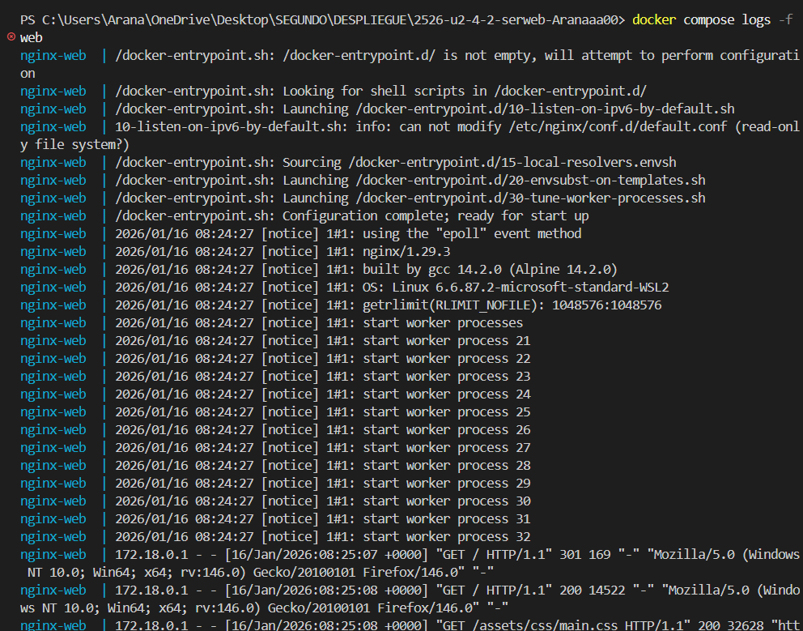

#### Extraccion de metricas

Con `awk` puedo analizar los logs y extraer estadisticas:

**Top URLs mas solicitadas:**
```bash
docker compose exec web sh -c "awk '{print \$7}' /var/log/nginx/access.log | sort | uniq -c | sort -nr | head"
```

**Codigos de respuesta:**
```bash
docker compose exec web sh -c "awk '{print \$9}' /var/log/nginx/access.log | sort | uniq -c | sort -nr | head"
```

**URLs que generan 404:**
```bash
docker compose exec web sh -c "awk '\$9==404 {print \$7}' /var/log/nginx/access.log | sort | uniq -c | sort -nr | head"
```

Estas metricas permiten:
- Ver que paginas son mas visitadas
- Detectar errores frecuentes (muchos 404 o 500)
- Identificar URLs rotas o ataques (peticiones a rutas sospechosas)

Evidencia: 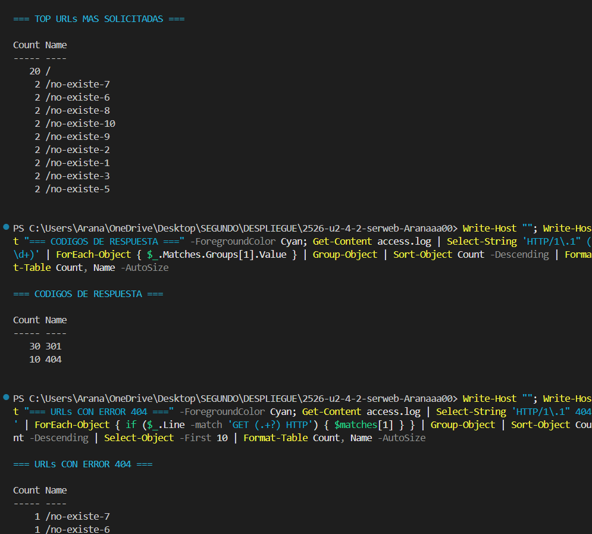
---

## Checklist final

### Parte 1
- [x] 1) Servicio Nginx activo → [evidencia](./evidencias/01-nginx-activo.png)
- [x] 2) Configuracion cargada → [evidencia](./evidencias/02-configuracion-cargada.png)
- [x] 3) Resolucion de nombres → [evidencia](./evidencias/03-resolucion-nombres.png)
- [x] 4) Contenido Web (Cloud Academy) → [evidencia](./evidencias/03-resolucion-nombres.png)
- [x] 5) Conexion SFTP exitosa → [evidencia](./evidencias/05-conexion-sftp.png)
- [x] 6) Permisos de escritura → [evidencia](./evidencias/06-permiso-escritura.png)
- [x] 7) Contenedores activos → [evidencia](./evidencias/01-nginx-activo.png)
- [x] 8) Persistencia (Volumen compartido) → [evidencia](./evidencias/07-persistencia-volumen.png)
- [x] 9) Despliegue multi-sitio (/reloj) → [evidencia](./evidencias/08-multisitio-reloj.png)
- [x] 10) Cifrado SSL → [evidencia](./evidencias/09-cifrado-ssl.png)
- [x] 11) Redireccion forzada (301) → [evidencia](./evidencias/10-redireccion-https.png)

### Parte 2 (RA2)
- [x] a) Parametros de administracion → [evidencias 11-13](./evidencias/11-grep-nginxconf.png)
- [x] b) Ampliacion de funcionalidad + modulo investigado → [evidencias 14-15](./evidencias/14-defaultconf-headers.png)
- [x] c) Sitios virtuales / multi-sitio → [evidencias 16-18](./evidencias/16-root.png)
- [x] d) Autenticacion y control de acceso → [evidencias 19-22](./evidencias/19-admin-html.png)
- [x] e) Certificados digitales → [evidencias 23-25](./evidencias/23-ls-certificado.png)
- [x] f) Comunicaciones seguras → [evidencias 26-27](./evidencias/26-https.png)
- [x] g) Documentacion → DESPLIEGUE.md completo
- [x] h) Ajustes para implantacion de apps → [evidencias 16-17](./evidencias/16-root.png)
- [x] i) Virtualizacion en despliegue → [evidencia 28](./evidencias/28-compose-ps.png)
- [x] j) Logs: monitorizacion y analisis → [evidencia 29](./evidencias/29-logs-follow.png)
