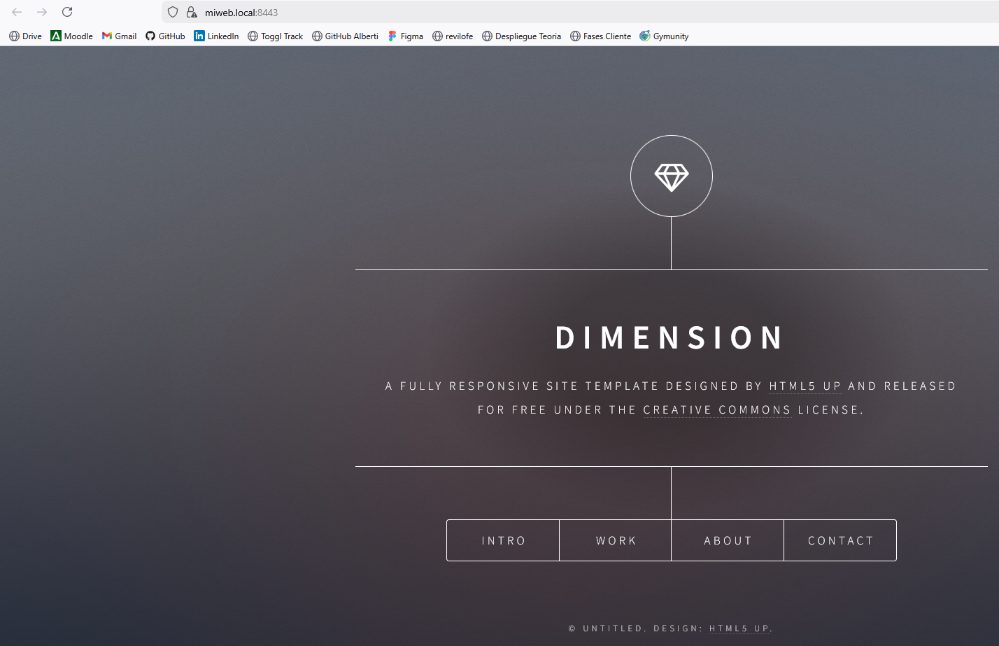
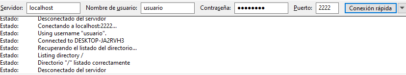
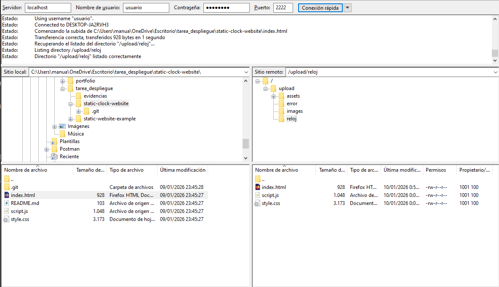
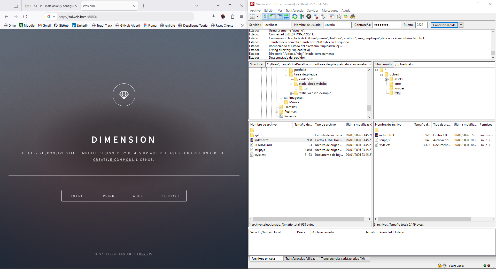
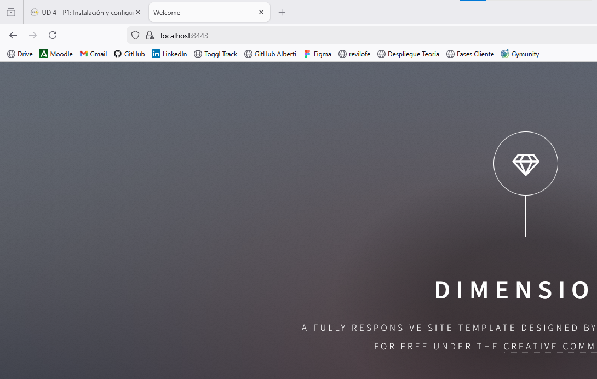
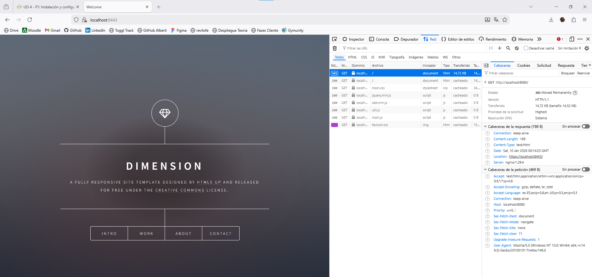

# DESPLIEGUE — Evidencias y respuestas

Este documento recopila todas las evidencias y respuestas de la practica.

---

## Parte 1 — Evidencias minimas

### Fase 1: Instalacion y configuracion

1) Servicio Nginx activo
- Que demuestra: El servidor Nginx esta corriendo correctamente dentro del contenedor Docker
- Comando: `docker compose ps`
- Evidencia: 

2) Configuracion cargada
- Que demuestra: El archivo de configuracion personalizado (default.conf) esta correctamente montado en el contenedor
- Comando: `docker exec nginx-web ls -la /etc/nginx/conf.d/`
- Evidencia: 

3) Resolucion de nombres
- Que demuestra: El archivo hosts de Windows esta configurado para resolver nombres personalizados (127.0.0.1 miweb.local)
- Evidencia: 

4) Contenido Web
- Que demuestra: La pagina web personalizada de Cloud Academy se muestra correctamente (no es la pagina por defecto de Nginx)
- Evidencia: 

### Fase 2: Transferencia SFTP (Filezilla)

5) Conexion SFTP exitosa
- Que demuestra: FileZilla se conecta correctamente al servidor SFTP usando localhost:2222 con credenciales usuario/password
- Evidencia: 

6) Permisos de escritura
- Que demuestra: Los archivos se pueden subir por SFTP sin errores de permisos
- Evidencia: 

### Fase 3: Infraestructura Docker

7) Contenedores activos
- Que demuestra: Ambos contenedores (nginx-web y sftp-server) estan corriendo simultaneamente con sus puertos mapeados
- Comando: `docker compose ps`
- Evidencia: 

8) Persistencia (Volumen compartido)
- Que demuestra: Los archivos subidos por SFTP aparecen automaticamente en la web gracias al volumen compartido shared-data
- Evidencia: 

9) Despliegue multi-sitio
- Que demuestra: El servidor web sirve multiples sitios - la web principal en / y el reloj en /reloj
- Evidencia: 

### Fase 4: Seguridad HTTPS

10) Cifrado SSL
- Que demuestra: El servidor responde por HTTPS con certificados SSL autofirmados correctamente configurados
- Evidencia: 

11) Redireccion forzada
- Que demuestra: Las peticiones HTTP (puerto 8080) se redirigen automaticamente a HTTPS (puerto 8443) con codigo 301
- Evidencia: 

---

## Parte 2 — Evaluacion RA2 (a–j)

### a) Parametros de administracion
- Respuesta:
- Evidencias:
  - evidencias/a-01-grep-nginxconf.png
  - evidencias/a-02-nginx-t.png
  - evidencias/a-03-reload.png

### b) Ampliacion de funcionalidad + modulo investigado
- Opcion elegida (B1 o B2):
- Respuesta:
- Evidencias (B1 o B2):
  - evidencias/b1-01-gzipconf.png
  - evidencias/b1-02-compose-volume-gzip.png
  - evidencias/b1-03-nginx-t.png
  - evidencias/b1-04-curl-gzip.png
  - evidencias/b2-01-defaultconf-headers.png
  - evidencias/b2-02-nginx-t.png
  - evidencias/b2-03-curl-https-headers.png

#### Modulo investigado: <NOMBRE>
- Para que sirve:
- Como se instala/carga:
- Fuente(s):

### c) Sitios virtuales / multi-sitio
- Respuesta:
- Evidencias:
  - evidencias/c-01-root.png
  - evidencias/c-02-reloj.png
  - evidencias/c-03-defaultconf-inside.png

### d) Autenticacion y control de acceso
- Respuesta:
- Evidencias:
  - evidencias/d-01-admin-html.png
  - evidencias/d-02-defaultconf-auth.png
  - evidencias/d-03-curl-401.png
  - evidencias/d-04-curl-200.png

### e) Certificados digitales
- Respuesta:
- Evidencias:
  - evidencias/e-01-ls-certs.png
  - evidencias/e-02-compose-certs.png
  - evidencias/e-03-defaultconf-ssl.png

### f) Comunicaciones seguras
- Respuesta:
- Evidencias:
  - evidencias/f-01-https.png
  - evidencias/f-02-301-network.png

### g) Documentacion
- Respuesta:
- Evidencias: enlaces a todas las capturas

### h) Ajustes para implantacion de apps
- Respuesta:
- Evidencias:
  - evidencias/h-01-root.png
  - evidencias/h-02-reloj.png

### i) Virtualizacion en despliegue
- Respuesta:
- Evidencias:
  - evidencias/i-01-compose-ps.png

### j) Logs: monitorizacion y analisis
- Respuesta:
- Evidencias:
  - evidencias/j-01-logs-follow.png
  - evidencias/j-02-metricas.png

---

## Checklist final

### Parte 1
- [ ] 1) Servicio Nginx activo
- [ ] 2) Configuracion cargada
- [ ] 3) Resolucion de nombres
- [ ] 4) Contenido Web (Cloud Academy)
- [ ] 5) Conexion SFTP exitosa
- [ ] 6) Permisos de escritura
- [ ] 7) Contenedores activos
- [ ] 8) Persistencia (Volumen compartido)
- [ ] 9) Despliegue multi-sitio (/reloj)
- [ ] 10) Cifrado SSL
- [ ] 11) Redireccion forzada (301)

### Parte 2 (RA2)
- [ ] a) Parametros de administracion
- [ ] b) Ampliacion de funcionalidad + modulo investigado
- [ ] c) Sitios virtuales / multi-sitio
- [ ] d) Autenticacion y control de acceso
- [ ] e) Certificados digitales
- [ ] f) Comunicaciones seguras
- [ ] g) Documentacion
- [ ] h) Ajustes para implantacion de apps
- [ ] i) Virtualizacion en despliegue
- [ ] j) Logs: monitorizacion y analisis
